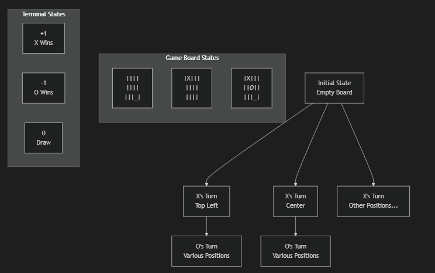
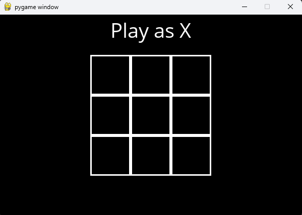
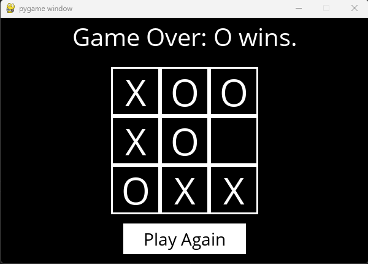

# **Tic-Tac-Toe AI Documentation**

# Overview
This document explains the implementation of an unbeatable Tic-Tac-Toe AI using the Minimax algorithm with Alpha-Beta pruning optimization.

# Game Representation
The game uses a `3x3` grid with three possible cell states:
- 'X' (Player X)
- 'O' (Player O)
- Empty (None)

# Game Tree Visualization


# Core Game Logic Components
## 1. Board State Management
### Initial State


### Turn Determination

 - X moves first
 - Players alternate turns
 - Turn determined by counting filled positions:

    - Even count → X's turn
    - Odd count → O's turn


## 2. Move Validation

- Valid moves are any empty cells
- Each move uses (row, column) coordinates
- System prevents:

    - Playing in occupied cells
    - Playing out of bounds
    - Playing after game end

## 3. Win Detection
Checks three winning conditions:
```
Horizontal:   Vertical:    Diagonal:
X X X         X | X       X | |
| | |         X | |       | X |
| | |         X | |       | | X
```

## 4. Game State Evaluation
Terminal states values:

- X Victory: +1
- O Victory: -1
- Draw: 0

# AI Strategy: Minimax Algorithm
## Basic Concept
Minimax explores all possible future game states to make optimal moves.
## How It Works
### 1. Maximum Depth Search
```
Root (Current State)
├── Move 1
│   ├── Response 1.1
│   └── Response 1.2
└── Move 2
    ├── Response 2.1
    └── Response 2.2
```
### 2. Role Alternation

- X = Maximizing player (seeks +1)
- O = Minimizing player (seeks -1)
- Both assume optimal opponent play

### 3. Value Propagation
```
Max Node (X)
├── Min Node (+1)
└── Min Node (0)
Final Value: +1
```

# Optimization: Alpha-Beta Pruning
## Key Concepts

- α (alpha): Best assured value for Maximizer
- β (beta): Best assured value for Minimizer
- Pruning occurs when α ≥ β
## Example Scenario
```
      Max (α=-∞)
     /           \
Min (β=∞)    [Pruned]
   /  \
(+1)  (0)
```

# Game Play

